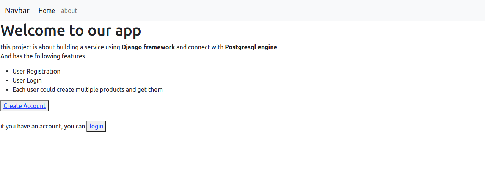
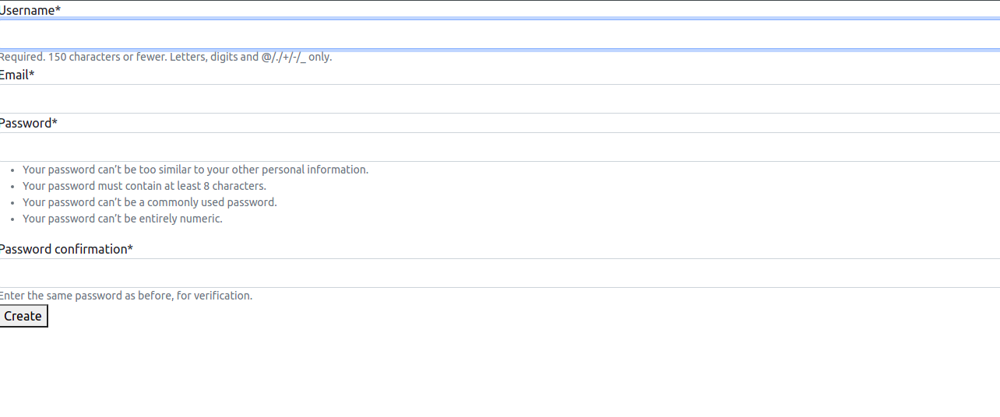
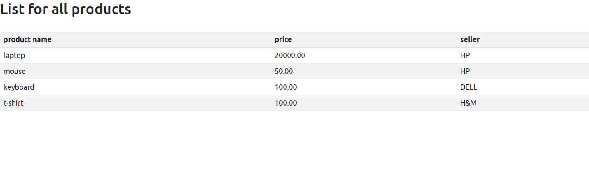

# Login_and_Registration_System

following this instructions to run the project after download it:

1- create virtual environment

2- install the packages from **requirements.txt** file by this commend : [pip install -r requirements.txt]

4- create a database called **dbtest** by pgadmin4 to connect with it

3- move to the next directory to see **manage.py** file when run in the terminal [!ls]

4- run this commend to run the project [python manage.py runserver]

enjoy with it

